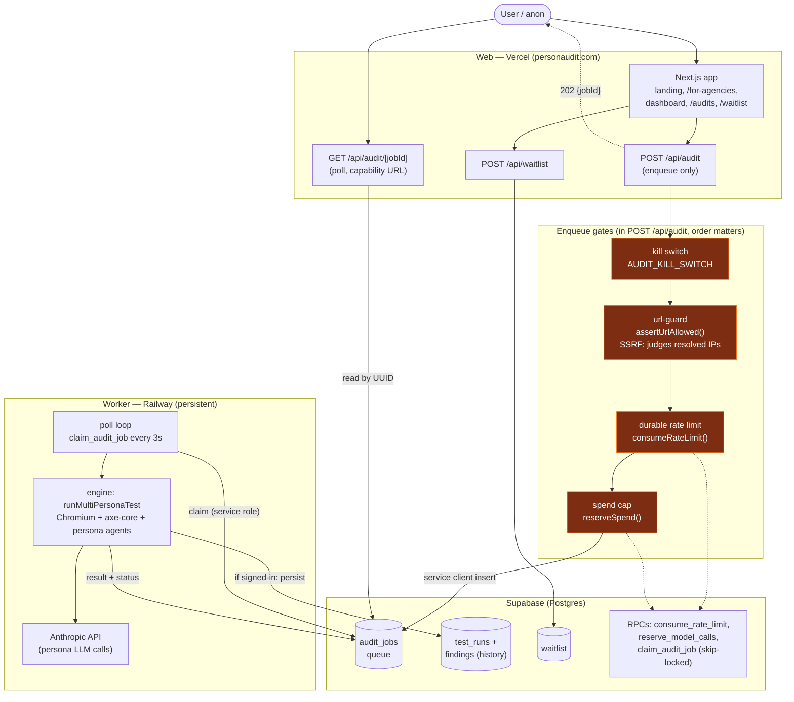

# Personaudit — System Architecture

Snapshot as of 2026-07-28. Written against `main` (HEAD at read time). Regenerate if the
web→queue→worker split or the security chokepoints change.

Two deploy surfaces share one Supabase project (`vsqglpanxeqbnvuyzbmo`): the **web app**
on Vercel (thin, serverless — no browser) and the **worker** on Railway (persistent,
runs Chromium + the engine). They never call each other directly; the `audit_jobs` queue
is the only coupling.

## Load-bearing facts

- **The web route never runs a browser.** Vercel serverless has no Chromium and blows the
  size/time limits. `POST /api/audit` only validates + enqueues, returns `202 {jobId}`.
  `worker/src/index.ts` is the only place the browser runs.
- **Enqueue gate order** (`web/src/app/api/audit/route.ts`): kill switch → rate limit →
  URL guard → spend reserve → insert. All durable in Postgres (not in-process) so they
  hold across serverless instances.
- **`url-guard.ts` is the SSRF chokepoint** — resolves the hostname and judges the
  resolved addresses (blocks link-local, RFC1918, `metadata.google.internal`,
  `[::ffff:169.254.169.254]`). The engine re-checks every navigation, so this is the
  outer gate, not the only one. `--allow-private` is CLI-only and must NEVER be set on the
  hosted path.
- **Anon jobs are capability URLs.** `audit_jobs` has no client insert/update policy;
  owners read their own via RLS, anon reads only through the service-backed poll endpoint
  keyed by the unguessable UUID.
- **Residual security gap:** the Railway worker has no egress firewall — url-guard is the
  mitigation, DNS-rebinding is the residual. Blocker before fully-public-anon. See
  `docs/DEPLOYMENT.md`.
