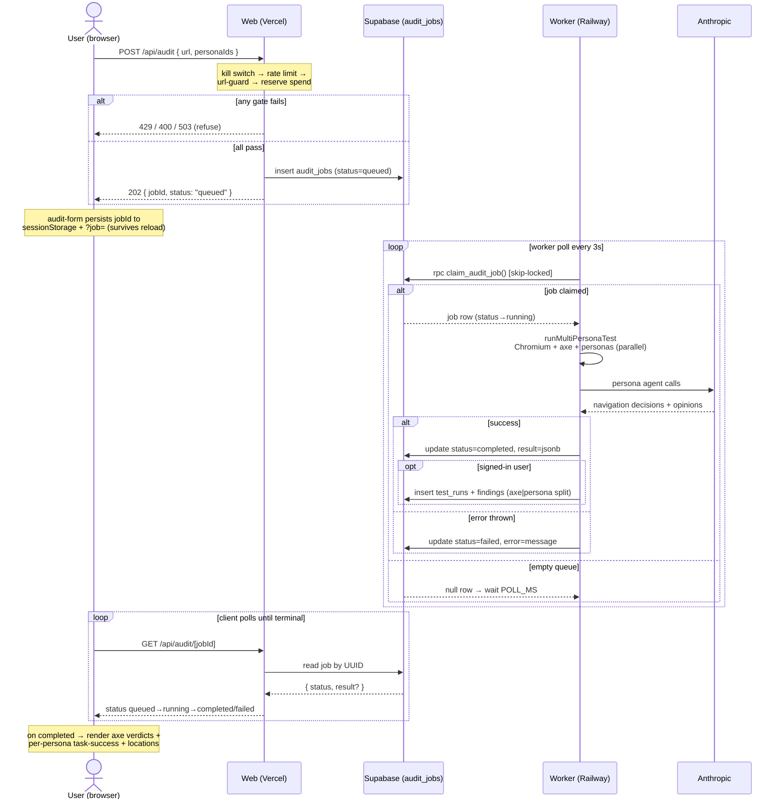

# Personaudit — Audit Job Lifecycle

Snapshot as of 2026-07-28. The async submit→worker→poll loop that every session
re-derives. Source: `web/src/app/api/audit/route.ts`, `web/src/app/api/audit/[jobId]/route.ts`,
`worker/src/index.ts`, migration `005_audit_jobs_queue.sql`.

## States

`queued` → `running` → (`completed` | `failed`). Terminal = `completed`/`failed`.
`claim_audit_job` is `security definer`, `for update skip locked`, revoked from
anon/authenticated — only the service-role worker can claim. `attempts` increments on
each claim (no auto-retry wired yet; a failed job stays failed).

## Non-obvious behaviors

- **Anon-scan survives reload:** jobId is written to `sessionStorage` + `?job=`; the form
  resumes polling on mount. A timeout keeps the job and shows "Check status" re-poll that
  never re-consumes quota.
- **History is best-effort:** `persistHistory` failures never fail the job. Only signed-in
  jobs get `test_runs`/`findings` rows; anon results live only in `audit_jobs.result`.
- **Findings carry a source split:** `source = 'axe' | 'persona'` — axe = compliance
  verdict, persona = navigation opinion. Never blurred (CONTEXT.md).
