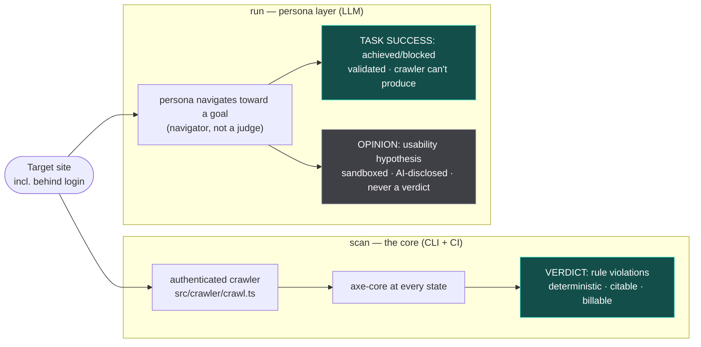

# Personaudit — scan vs run (the two outputs, never blurred)

Snapshot as of 2026-07-28. The evidence-backed product split. Source: README.md,
CONTEXT.md, `experiments/`.

## The boundaries (validated — do not cross)

- **`scan` needs NO `ANTHROPIC_API_KEY`** (source-guarded by `scan-keyless.test.ts`).
  Deterministic, drops into CI (`--fail-on <sev> --baseline` exits 2 on NEW defects only).
- **Personas do NOT beat a crawler at finding a11y defects** — measured and killed
  (`experiments/personas-vs-crawler/`: crawler reached 40 states vs personas' 9, zero
  model cost). Never revive the "AI personas find what crawlers can't" pitch.
- **Task success is the persona layer's real, validated value** (n=2: Metabase +
  SauceDemo, 0% false-success, 90% agreement). A crawler cannot produce it.
- **Three output tiers, hard walls:** Verdict (axe, billable) / Task success (observed) /
  Opinion (AI, sandboxed, never a verdict). `src/personas/framing.test.ts` enforces no
  disability-simulation / no compliance-claim regressions — keep it green.
