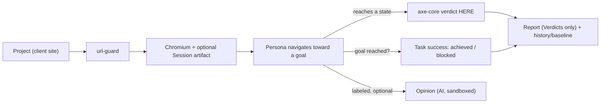

# Personaudit — Product Design

Snapshot as of 2026-07-27. Written against branch `fix/audit-p0-p1-honesty-a11y`.
Grounded in: two market-research passes (this session), README thesis, the
`experiments/` findings, and CONTEXT.md. This is a destination doc — once work starts,
reality lives in the code + issues + the continuity ledger, not here.

## One-liner

**Personaudit audits your site like a real person.** An agent walks your product as
different real-shaped users, reaches the states behind your login a URL-scanner never
sees, and reports where each one hit an accessibility wall or couldn't finish the job —
with a defensible axe-core verdict at every step.

Not a URL scanner (that is rocket-vitals). An agent that *experiences* the product.

## Who it's for

Primary wedge: **agencies + freelancers shipping many client sites** under ADA / EU
Accessibility Act pressure. They sit in an underserved gap — free single-site DIY (axe,
Pa11y, WAVE, GitHub's own a11y Action) below, $10–50K/yr enterprise (Deque, Siteimprove)
above. Nothing at $50–300/mo does multi-site + authenticated + report.

Secondary: indie SaaS founders pre-launch (real but discretionary, skeptical of recurring
AI-opinion spend — do not build for them first).

## The job they pay for

Defensible **accessibility evidence across authenticated states, for all their client
sites, in CI, plus a Report they hand the client or lawyer.** The persona task-success +
opinion is why they *pick* Personaudit over a bare scanner; compliance coverage + the
Report is what they *pay* for. Bill on the thing with legal budget; win the pick on the
persona identity.

## Output model — three tiers, hard walls

| Tier | Source | Trust status | Billable / legal? |
|------|--------|--------------|-------------------|
| **Verdict** | axe-core | deterministic fact | Yes — the spine |
| **Task success** | persona agent | observed achieved/blocked | Yes — the differentiator |
| **Opinion** | persona LLM | labeled AI hypothesis, "verify" | No — hypothesis only |

Hard constraints (extend `framing.test.ts` to enforce):
- Opinion never carries a severity, never enters the Report, always AI-disclosed.
- No disability simulation, ever. Personas never render the compliance verdict.
- The three tiers are never blurred in the UI.

## How it works — the loop

## Architecture: two scan modes (see ADR 0001)

- **Hosted** — user hands us a short-lived **Session artifact** (storageState) they
  generate locally; we scan, encrypt at rest, destroy after scan+TTL. Never a password.
- **CLI / local** — fully local; nothing leaves the machine. For prod / sensitive sites.

## What exists vs what's missing

Already real (this session + prior): public hosted scan, worker queue (Railway), durable
rate-limit + spend cap, url-guard SSRF chokepoint, axe + persona engine, CLI with baseline
CI-gate, honest positioning + a11y pass + Personaudit rebrand (branch in flight).

Gaps to build for the wedge:
- **Projects / multi-site** — manage N client sites; the dashboard history rows are dead
  today (P2 audit finding) — make them open a per-run detail.
- **Report export** — VPAT-lite / PDF from Verdicts. The agency handoff artifact.
- **Hosted behind-login** — the Session-artifact pipeline (ADR 0001).
- **CI gate surfaced** — it exists in the CLI; document + expose it as a selling point.
- **Scheduled re-scans** + baseline/regression UI ("defects cleared over time" — the
  landing already promises this).
- **Opinion tier** — sandboxed UI + disclosure.
- **Plans / billing.**

## Pricing (draft — validate, don't hardcode)

- **Free** — 1 public site, on-demand scan (the current hosted taste).
- **Starter (~$49/mo)** — a few sites, CI gate, behind-login (Session artifact), Reports.
- **Agency (~$149–299/mo)** — many sites, seats, scheduled scans, white-label Report.

Anchors from research: axe DevTools $45/mo, PageAudit $29/site, RAMP $299–599/mo, manual
agency audit ~£4,950/site (the pain we undercut).

## The honest demand risk — read before building heavy

Three findings the research could NOT wave away:
1. **Behind-login willingness-to-pay is unproven** — no source confirmed budget for
   *authenticated* (vs public) scanning specifically. It is our core differentiator and
   it is the least-validated claim.
2. **GitHub ships a free authenticated-a11y CI Action** — "only one who scans behind
   login" is false. We beat it only on multi-site management + the Report + task-success,
   none of which it does. That must be the pitch, not "we scan behind login."
3. **Persona opinion is trust-fragile** — sandbox it or it sinks credibility.

**Do the cheap test before the expensive build.** Before weeks of hosted-auth + Report +
multi-site infra, run a pre-sell: a landing aimed at agencies ("authenticated a11y +
compliance Reports for all your client sites, $X/mo"), drive a little traffic, measure
signups / replies / "take my money." A handful of agency yeses = build. Silence = the
wedge is wrong and we learned it for ~$0 instead of a month.

## Roadmap

- **Phase A — honesty + close dead-ends** (largely done this session): rebrand, a11y pass,
  honest copy, + make history rows open a detail view.
- **Phase A.5 — the demand test** (cheap, do next): agency pre-sell landing + traffic.
- **Phase B — the wedge** (only if A.5 shows pull): Projects/multi-site, Report export,
  CI-gate surfaced, hosted Session-artifact behind-login, plans/billing.
- **Phase C — depth**: Opinion tier UI, scheduled scans, baseline/regression UI, seats.

## Open questions

- Session-artifact capture UX: reuse CLI `auth` output, or build a browser-extension
  capture helper? (Extension = less friction, more to build.)
- Report format: true VPAT, or a lighter branded PDF first?
- Does the agency buyer want white-label / their-logo Reports at Starter or only Agency?
